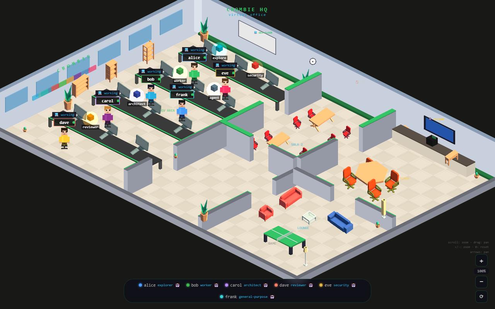

# Crombie Virtual Office

Real-time retro-isometric virtual office. Ver en tiempo real quién está trabajando, qué agentes están corriendo y cuándo alguien hace un commit.

**Live**: [https://coe.crombie.dev](https://coe.crombie.dev)



---

## Cómo funciona

Cada desarrollador instala un hook de Claude Code que reporta eventos al servidor. El servidor los difunde vía WebSocket a todos los clientes conectados.

```
Claude Code (dev)
  └─ PreToolUse / PostToolUse / Stop hooks
       └─ office-hook.js
            └─ POST https://office.coe.crombie.dev/event
                     │
              EC2 t2.micro + Nginx + Node.js
                     │
              WebSocket broadcast
                     │
         React SPA (https://coe.crombie.dev)
```

### Eventos

| Evento | Cuándo |
|--------|--------|
| `session_start` | Primer tool use de la sesión |
| `thinking` | Claude procesa (debounced 2s) |
| `agent_start` | Subagente lanzado |
| `agent_end` | Subagente completado |
| `commit` | `git commit` detectado en Bash |
| `session_end` | Sesión terminada (Stop hook) |

---

## Setup para desarrolladores

El hook se instala automáticamente desde [crombie-skills-setup](https://github.com/crombie-llc/agents-configuration):

```bash
npx crombie-skills-setup
# Elegir Workstation → Custom → Virtual Office
# URL del servidor: https://office.coe.crombie.dev (pre-filled)
```

Eso es todo. La próxima vez que uses Claude Code vas a aparecer en la oficina.

---

## Desarrollo local

```bash
npm install
npm run dev        # inicia servidor (:4242) y cliente (:3000) en paralelo
```

El cliente usa `VITE_WS_URL` para conectarse al servidor:

```bash
# Apuntar a producción desde el cliente local
VITE_WS_URL=wss://office.coe.crombie.dev npm run dev --workspace=packages/client
```

---

## Estructura

```
packages/
├── server/          Express + ws — HTTP y WebSocket en el mismo puerto
│   └── src/
│       ├── index.ts       Entry point (PORT y CORS_ORIGIN desde env)
│       ├── state.ts       StateManager en memoria
│       ├── events.ts      Parsing y validación de eventos
│       └── ws.ts          BroadcastServer
├── client/          React 18 + Vite + Phaser 3
│   └── src/
│       ├── App.tsx              WebSocket + lazy load del juego
│       ├── game/OfficeScene.ts  Escena isométrica principal
│       ├── game/Avatar.ts       Personaje de cada dev
│       ├── game/AgentBot.ts     Cubo isométrico para agentes
│       └── fallback/            Vista de presencia sin WebGL
└── hook/            office-hook.js — script Node.js para los hooks de Claude Code
```

---

## Infraestructura (AWS)

Provisionada con Terraform en `infra/`. Ver [docs/aws-deploy.md](docs/aws-deploy.md) para arquitectura completa, costos y runbook.

| Recurso | Uso |
|---------|-----|
| EC2 t2.micro | Servidor Node.js + Nginx + Let's Encrypt |
| S3 + CloudFront | React SPA estática |
| Route53 | `office.coe.crombie.dev` (server) · `coe.crombie.dev` (client) |
| ACM | Wildcard `*.coe.crombie.dev` |

### Deploy

```bash
# Infra (primera vez)
cd infra
terraform apply -var="ssh_public_key=$(cat ~/.ssh/id_rsa.pub)" -var="my_ip=<tu-ip>/32"

# App — push a main dispara GitHub Actions automáticamente
git push origin main
```
